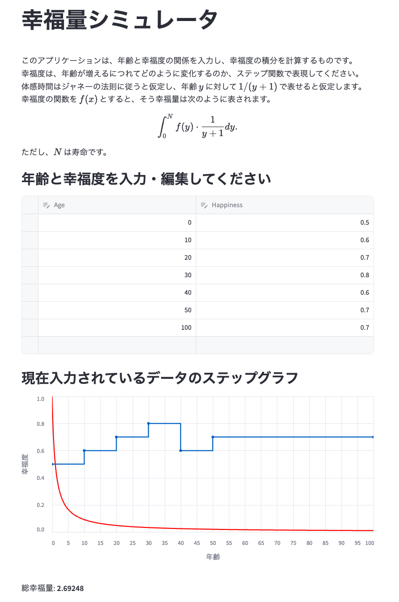

# 幸福度シミュレータ

幸福度の変化をインタラクティブにシミュレーションできるWebアプリケーションです。


## 使い方

1. 表形式のエディタで年齢と幸福度のデータを入力
2. "+" ボタンで新しいデータポイントを追加
3. グラフが自動的に更新され、入力したデータを表示
4. 積分値である総幸福量が表示される



## インストール・起動

```sh
poetry install
poetry run streamlit run app.py
```